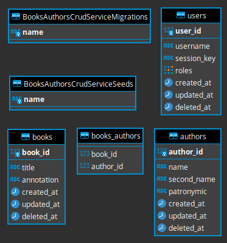

# books-authors-crud

## 1 Clone repository

Clone repository and install dependencies:

```bash
$ git clone git@github.com:EliseevNP/books-authors-crud.git
$ cd books-authors-crud
$ npm i
```

## 2 Start application (two ways)

### 2.1 Via docker-compose

Copy enviroment variables:

```bash
$ cp .env.example.docker .env
```

Start application:

```bash
$ docker-compose up # start builded application (from /dist directory)
# OR
$ docker-compose -f dev.docker-compose.yml up # start application with hot reload enabled
```

### 2.2 Via 'npm run' command

Copy enviroment variables:

```bash
$ cp .env.example .env
```

Setup database:

```bash
# start database
$ docker-compose -f enviroment.docker-compose.yml up

# run migrations and seeds (in other terminal tab)
$ npm run build
$ npm run db:migrate
$ npm run db:seed
```

Start application:

```bash
$ npm run start # start builded application (from /dist directory)
# OR
$ npm run dev # start application with hot reload enabled
```

## 3 Database after the application has been started

### 3.1 Connection credits:

```
database = postgres
user = postgres
password = postgres
host = localhost
port = 15432
```

### 3.2 Structure:



### 3.3 Data:

**books** table:

| book_id | title                    | annotation                                                                                                                                                                                                                                                      | created_at          | updated_at          | deleted_at |
| :------ | :----------------------- | :-------------------------------------------------------------------------------------------------------------------------------------------------------------------------------------------------------------------------------------------------------------- | :------------------ | :------------------ | :--------- |
| 1       | Мастер и Маргарита       | "Мастер и Маргарита" - итоговое произведение выдающегося отечественного прозаика и драматурга Михаила Афанасьевича Булгакова. Обещание, содержащееся на страницах книги - "ваш роман вам принесет еще сюрпризы", - оправдалось вполне: написанный Мастером пров | 2021-09-26 15:54:00 | 2021-09-26 15:54:00 |            |
| 2       | Мёртвые души             | «…Говоря о „Мертвых душах“, можно вдоволь наговориться о России», – это суждение поэта и критика П. А. Вяземского объясняет особое место поэмы Гоголя в истории русской литературы: и огромный успех у читателей, и необычайную остроту полемики вокруг главной | 2021-09-26 15:54:00 | 2021-09-26 15:54:00 |            |
| 3       | Двенадцать стульев       | И. Ильф и Е. Петров завершили роман «Двенадцать стульев» в 1928 году, но еще до первой публикации цензоры изрядно сократили, «почистили» его. Правка продолжалась от издания к изданию еще десять лет. В итоге книга уменьшилась почти на треть. Публикуемый ны | 2021-09-26 15:54:00 | 2021-09-26 15:54:00 |            |
| 4       | Собачье сердце           | «Собачье сердце» – одно из самых любимых читателями произведений Михаила Булгакова. Вас ждёт полный рассказ о необыкновенном эксперименте гениального доктора.                                                                                                  | 2021-09-26 15:54:00 | 2021-09-26 15:54:00 |            |
| 5       | Преступление и наказание | «Преступление и наказание» (1866) — роман об одном преступлении. Двойное убийство, совершенное бедным студентом из-за денег. Трудно найти фабулу проще, но интеллектуальное и душевное потрясение, которое производит роман, — неизгладимо. В чем здесь загадка | 2021-09-26 15:54:00 | 2021-09-26 15:54:00 |            |
| 6       | Война и мир              | Роман-эпопея, описывающий события войн против Наполеона: 1805 года и отечественной 1812 года. Признан критикой всего мира величайшим эпическим произведением литературы нового времени.                                                                         | 2021-09-26 15:54:00 | 2021-09-26 15:54:00 |            |


**authors** table:

| author_id | name    | second_name | patronymic  | created_at          | updated_at          | deleted_at |
| :-------- | :------ | :---------- | :---------- | :------------------ | :------------------ | :--------- |
| 1         | Михаил  | Булгаков    | Афанасьевич | 2021-09-26 15:54:00 | 2021-09-26 15:54:00 |            |
| 2         | Николай | Гоголь      | Васильевич  | 2021-09-26 15:54:00 | 2021-09-26 15:54:00 |            |
| 3         | Илья    | Ильф        | Арнольдович | 2021-09-26 15:54:00 | 2021-09-26 15:54:00 |            |
| 4         | Евгений | Петров      | Петрович    | 2021-09-26 15:54:00 | 2021-09-26 15:54:00 |            |
| 5         | Федор   | Достоевский | Михайлович  | 2021-09-26 15:54:00 | 2021-09-26 15:54:00 |            |
| 6         | Лев     | Толстой     | Николаевич  | 2021-09-26 15:54:00 | 2021-09-26 15:54:00 |            |

**books_authors** table:

| book_id | author_id |
| :------ | :-------- |
| 1       | 1         |
| 2       | 2         |
| 3       | 3         |
| 3       | 4         |
| 4       | 1         |
| 5       | 5         |
| 6       | 6         |

**users** talbe:

| user_id | username       | session_key                | roles   | created_at          | updated_at          | deleted_at |
| :------ | :------------- | :------------------------- | :------ | :------------------ | :------------------ | :--------- |
| 1       | MIHAIL_RYBKIN  | MIHAIL_RYBKIN_SESSION_KEY  | {ADMIN} | 2021-09-26 15:54:00 | 2021-09-26 15:54:00 |            |
| 2       | NIKITA_ELISEEV | NIKITA_ELISEEV_SESSION_KEY | NULL    | 2021-09-26 15:54:00 | 2021-09-26 15:54:00 |            |

**BooksAuthorsCrudServiceMigrations** table:

| name                                         |
| :------------------------------------------- |
| 00000000000001-create-books-table.js         |
| 00000000000002-create-authors-table.js       |
| 00000000000003-create-books_authors-table.js |
| 00000000000004-create-users-table.js         |

**BooksAuthorsCrudServiceSeeds** table:

| name                                       |
| :----------------------------------------- |
| 00000000000001-fill-books-table.js         |
| 00000000000002-fill-authors-table.js       |
| 00000000000003-fill-books-authors-table.js |
| 00000000000004-fill-users-table.js         |

## 3 Endpoints documentation

### 3.1 Default `host`:`port`:

```
http://localhost:3000
```

### 3.2 Endpoints

### 3.2.1 Books ([postman collection playground](https://www.getpostman.com/collections/d3fdd3f5537998e7271d))

#### - Get books list

```
GET /api/books/list

query params: {
  page?: number;
  pageSize?: number;
}
```

#### - Get book by id

```
GET /api/books/:bookId

params: {
  bookId!: number;
}
```

#### - Create book (**admin** endpoint)

```
POST /api/books

body params: {
  title?: string | null;
  annotation?: string | null;
}

headers: {
  x-api-key: MIHAIL_RYBKIN_SESSION_KEY
}
```

#### - Set book authors (**admin** endpoint)

```
POST /api/books/set/authors

body params: {
  bookId!: number;
  authorIds!: number[];
}

headers: {
  x-api-key: MIHAIL_RYBKIN_SESSION_KEY
}
```

#### - Delete book (**admin** endpoint)

```
POST /api/books/:bookId

params: {
  bookId!: number;
}

headers: {
  x-api-key: MIHAIL_RYBKIN_SESSION_KEY
}
```

#### - Update book (**admin** endpoint)

```
POST /api/books/:bookId

params: {
  bookId!: number;
}

body params: {
  title?: string | null;
  annotation?: string | null;
}

headers: {
  x-api-key: MIHAIL_RYBKIN_SESSION_KEY
}
```

### 3.2.2 Authors

#### - Get authors list

```
GET /api/authors/list

query params: {
  page?: number;
  pageSize?: number;
}
```

#### - Get author by id

```
GET /api/authors/:authorId

params: {
  authorId!: number;
}
```

#### - Create author (**admin** endpoint)

```
POST /api/authors

body params: {
  name?: string | null;
  secondName?: string | null;
  patronymic?: string | null;
}

headers: {
  x-api-key: MIHAIL_RYBKIN_SESSION_KEY
}
```

#### - Set author books (**admin** endpoint)

```
POST /api/authors/set/books

body params: {
  authorId!: number;
  bookIds!: number[];
}

headers: {
  x-api-key: MIHAIL_RYBKIN_SESSION_KEY
}
```

#### - Delete author (**admin** endpoint)

```
POST /api/authors/:authorId

params: {
  authorId!: number;
}

headers: {
  x-api-key: MIHAIL_RYBKIN_SESSION_KEY
}
```

#### - Update author (**admin** endpoint)

```
POST /api/authors/:authorId

params: {
  authorId!: number;
}

body params: {
  title?: string | null;
  annotation?: string | null;
}

headers: {
  x-api-key: MIHAIL_RYBKIN_SESSION_KEY
}
```

## 4 TODO

- implement filters and sorts in '/list' endpoints;
- implement unit tests;
- refactoring (CRUD operations are similar to each other, so we need to move the CRUD logic into a separate npm-package and thus avoid code duplication);
- implement auto generated documentation;
- implement auth logic;
- etc.
